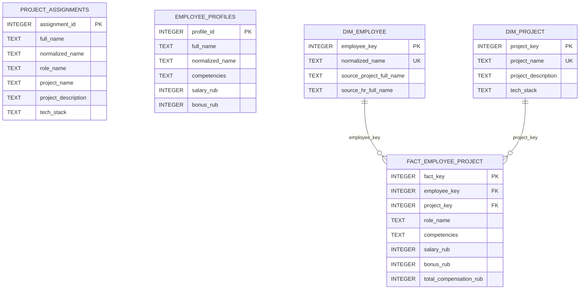

# Задание 1. Проектирование БД

## Выбор СУБД

Для демонстрационной реализации выбрана SQLite.

Обоснование:

- SQLite не требует отдельного сервера, поэтому проект легко показать преподавателю на любом компьютере.
- Для учебного набора данных скорость чтения и соединения таблиц достаточна с большим запасом.
- Поддерживаются реляционные таблицы, первичные ключи, внешние ключи, ограничения `CHECK`, индексы и транзакции.
- В реальной промышленной системе вместо SQLite логично использовать PostgreSQL для источников и ClickHouse/PostgreSQL для ХД, если объемы данных возрастают.

## Типы данных

- `INTEGER` используется для суррогатных ключей, зарплаты, премии и итоговой компенсации. Целые числа быстрее и безопаснее для денежных сумм в рублях, чем `REAL`, потому что нет ошибок округления с плавающей точкой.
- `TEXT` используется для ФИО, ролей, описаний проектов, компетенций и технологического стека.
- `normalized_name TEXT` используется как технический ключ сопоставления сотрудников между источниками.
- Индексы по `normalized_name` ускоряют объединение данных по ФИО.

## ER-диаграмма источников и ХД

## Структура ХД

Хранилище использует простую звездообразную схему:

- `dim_employee` - измерение сотрудников.
- `dim_project` - измерение проектов.
- `fact_employee_project` - факт участия сотрудника в проекте с финансовыми показателями.

Такой подход удобен для аналитики: можно группировать затраты по проектам, ролям, компетенциям и сотрудникам.
