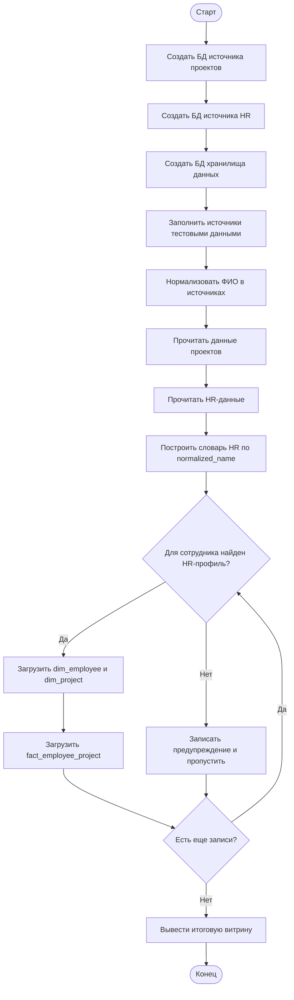

# Задание 1. Алгоритм ETL

## Цель

Собрать данные из двух разных источников и объединить их в третьей БД - хранилище данных.

Источник 1 содержит:

- ФИО сотрудника;
- роль в проекте;
- название проекта;
- описание проекта;
- технологический стек.

Источник 2 содержит:

- ФИО сотрудника;
- компетенции;
- зарплату;
- премию.

## Проблема качества данных

В разных БД ФИО записаны по-разному:

- изменен порядок слов;
- отличается регистр;
- возможны лишние пробелы.

Например:

- `Иванов Иван Петрович`;
- `ИВАН ПЕТРОВИЧ ИВАНОВ`.

## Правило нормализации ФИО

Алгоритм:

1. Привести ФИО к нижнему регистру.
2. Оставить только буквенные слова.
3. Отсортировать слова по алфавиту.
4. Соединить слова в строку.

Для двух примеров выше получится один ключ:

```text
иван иванов петрович
```

## Алгоритм загрузки



## BPMN

BPMN-файл находится здесь:

```text
task1_data_warehouse_demo/bpmn/task1_etl_collection.bpmn
```

Его можно открыть в Camunda Modeler и при необходимости экспортировать в PNG/SVG для отчета.
