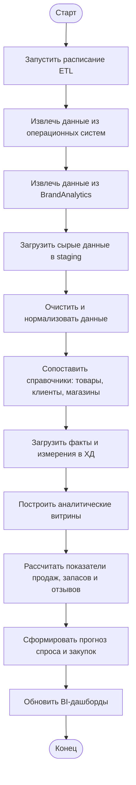

# Алгоритм сбора и анализа данных в ХД

## Общий алгоритм



## Аналитический сценарий

1. ETL забирает заказы из интернет-магазина, мобильного приложения и 1C Торговля.
2. Из WMS загружаются остатки, приемка и отгрузка.
3. Из CRM загружаются клиенты, обращения и история коммуникаций.
4. Из BrandAnalytics загружаются упоминания товаров, тональность и темы отзывов.
5. В staging данные сохраняются в исходном виде для аудита.
6. На этапе трансформации нормализуются даты, идентификаторы товаров, каналы продаж и справочники клиентов.
7. В ХД загружаются измерения и факты.
8. BI показывает продажи, маржинальность, остатки, отзывы, возвраты и прогноз закупок.

## BPMN

BPMN-файл находится здесь:

```text
task2_retail_architecture/bpmn/target_data_collection_and_analysis.bpmn
```

Его можно открыть в Camunda Modeler или Bizagi Modeler.
