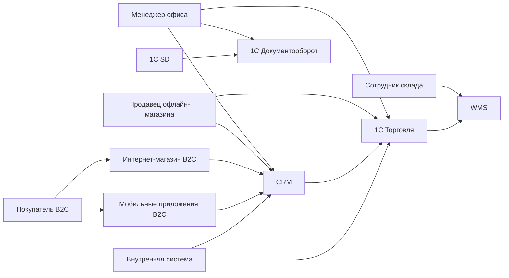
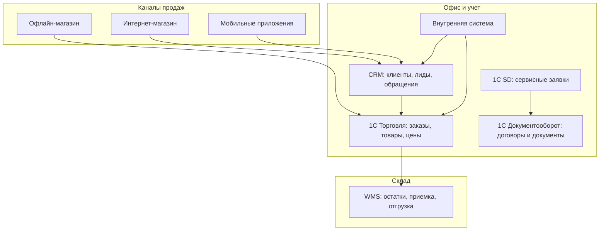

# Задание 2. Текущая функциональная архитектура

## Контекст C4



## Контейнеры текущей архитектуры



## Проблемы текущего состояния

- Данные распределены по системам и анализируются фрагментами.
- Нет единого места для анализа онлайн-продаж, офлайн-продаж, складских остатков, обращений и отзывов.
- Прогнозирование закупок осложнено: спрос, остатки, сезонность и отзывы находятся в разных контурах.
- Руководство получает отчеты с задержкой, потому что выгрузки часто собираются вручную.

## BPMN текущего процесса

BPMN-файл текущего процесса обработки продаж находится здесь:

```text
task2_retail_architecture/bpmn/current_sales_process.bpmn
```

Диаграмма показывает, что заказ обрабатывается операционными системами, а управленческий отчет в текущем состоянии формируется вручную из разных выгрузок.
