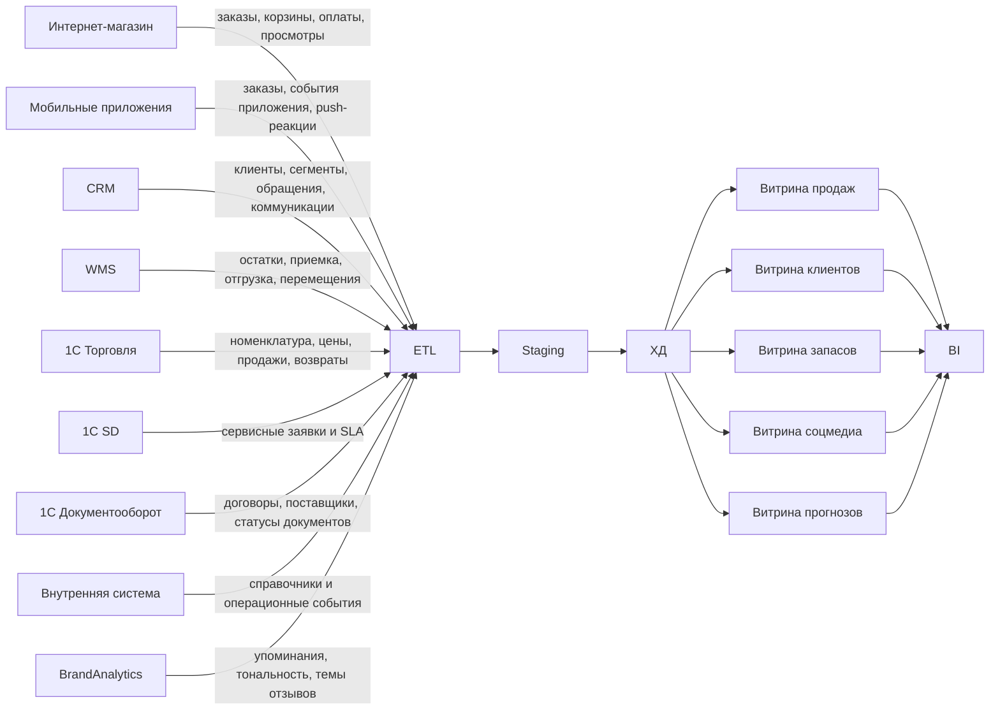

# Диаграмма потоков данных в ХД

## Какие данные можно анализировать

- Объемы покупок через интернет-магазин, мобильное приложение и офлайн-магазин.
- Динамику продаж по товарам, категориям, регионам, каналам и периодам.
- Остатки товаров, скорость оборачиваемости и риск дефицита.
- Эффективность CRM-коммуникаций и повторные покупки.
- Отзывы и упоминания продукции в соцмедиа через BrandAnalytics.
- Связь между негативными отзывами, возвратами, сервисными заявками и падением продаж.
- Прогноз закупок исходя из спроса, текущих остатков, сезонности и внешнего интереса к продуктам.
