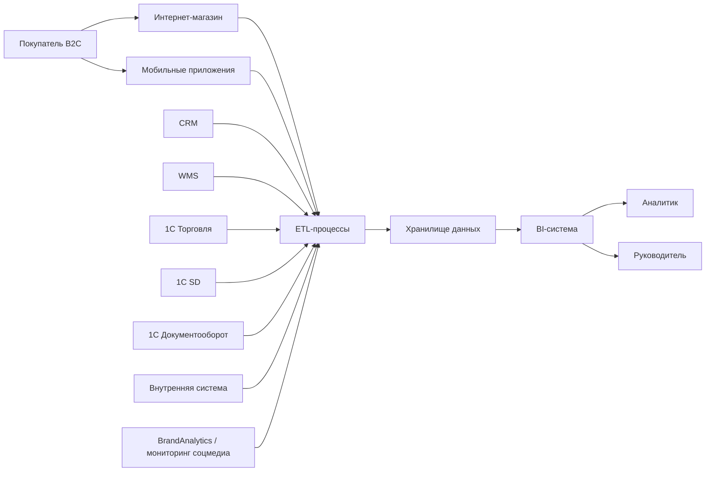
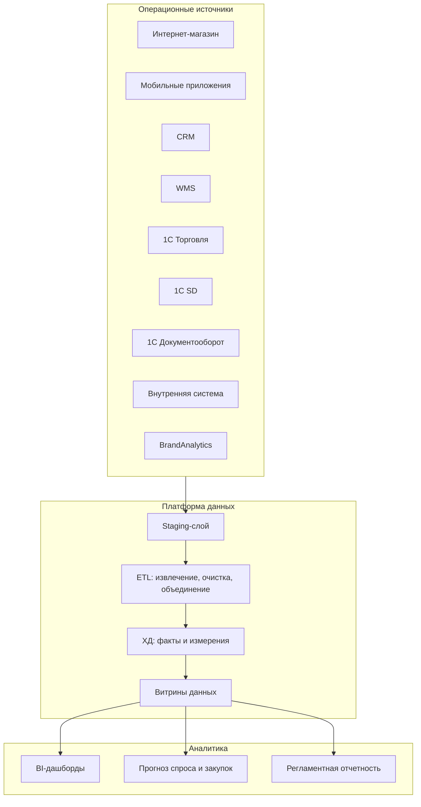

# Задание 2. Целевая архитектура

## Целевой контекст C4

Целевая архитектура сохраняет текущие системы и добавляет аналитический контур: ETL, ХД и BI.

## Контейнеры целевой архитектуры

## Что появляется после внедрения

- Единое ХД для анализа продаж, клиентов, товаров, остатков, обращений и отзывов.
- BI-дашборды для руководителей и аналитиков.
- Прогнозирование закупок на основе спроса, остатков, сезонности и внешнего сигнала из соцмедиа.
- Снижение ручной подготовки отчетов.
